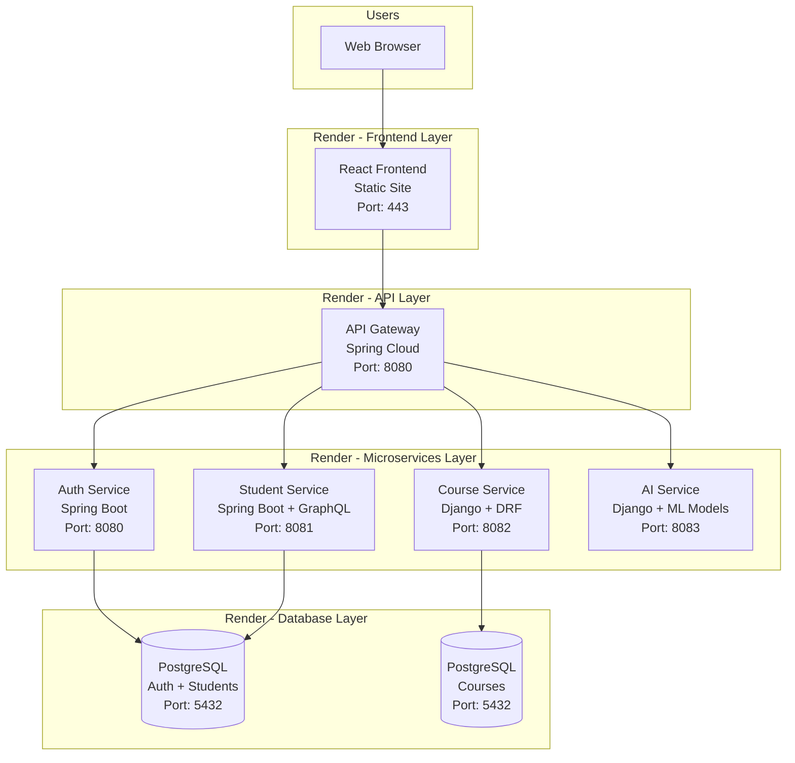
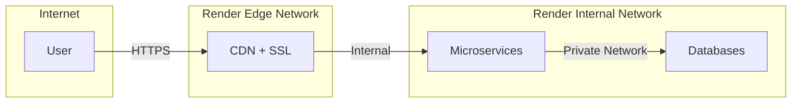
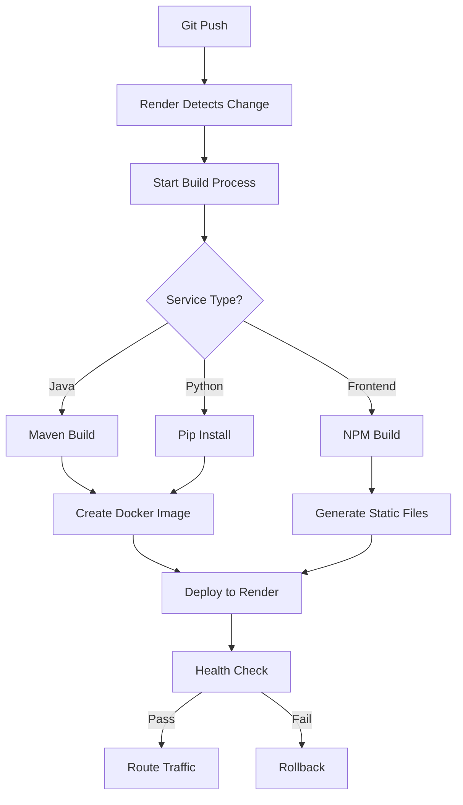
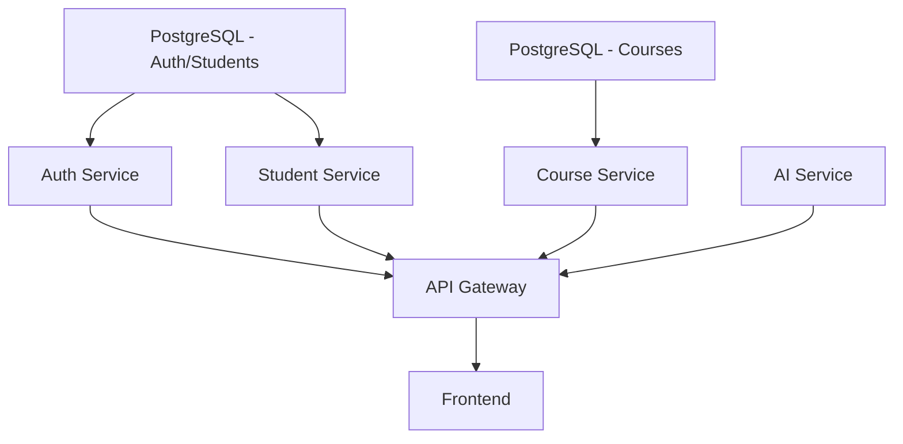

# 🏗️ Scholara Platform - Render Architecture

## Architecture Overview



## Service Details

### Frontend Layer
- **Technology**: React + Vite
- **Deployment Type**: Static Site
- **Plan**: Free
- **Features**: 
  - Automatic SSL
  - CDN distribution
  - SPA routing
  - Auto-deploy on Git push

### API Gateway
- **Technology**: Spring Cloud Gateway
- **Deployment Type**: Web Service (Docker)
- **Plan**: Free
- **Responsibilities**:
  - Route requests to microservices
  - CORS handling
  - Request/Response transformation
  - Load balancing

### Microservices

#### 1. Auth Service
- **Technology**: Spring Boot 3.2 + Spring Security
- **Database**: PostgreSQL (shared with Student)
- **Features**:
  - JWT authentication
  - Google OAuth 2.0
  - User registration/login
  - Profile management

#### 2. Student Service
- **Technology**: Spring Boot 3.2 + GraphQL
- **Database**: PostgreSQL (shared with Auth)
- **Features**:
  - Student CRUD operations
  - GraphQL API
  - Course enrollment tracking

#### 3. Course Service
- **Technology**: Django 4.2 + DRF
- **Database**: PostgreSQL (dedicated)
- **Features**:
  - Course management
  - RESTful API
  - GraphQL support

#### 4. AI Service
- **Technology**: Django 4.2 + Transformers
- **Plan**: Starter ($7/month) - requires more resources
- **Features**:
  - AI chatbot
  - ML model inference
  - NLP processing

### Databases
- **Type**: PostgreSQL 15
- **Plan**: Free (90 days retention, 1GB storage)
- **Backups**: Automatic daily backups
- **Connections**: SSL-enabled

## Network Architecture



## Deployment Flow



## Environment Configuration

### Development
```
Frontend → localhost:3000
API Gateway → localhost:8080
Auth Service → localhost:8080
Student Service → localhost:8081
Course Service → localhost:8082
AI Service → localhost:8083
```

### Production (Render)
```
Frontend → https://scholara-frontend.onrender.com
API Gateway → https://scholara-api-gateway.onrender.com
Auth Service → https://scholara-auth-service.onrender.com
Student Service → https://scholara-student-service.onrender.com
Course Service → https://scholara-course-service.onrender.com
AI Service → https://scholara-ai-service.onrender.com
```

## Scaling Strategy

### Horizontal Scaling
Render automatically handles:
- Load balancing
- Multiple instances
- Auto-scaling (paid plans)

### Database Scaling
- Connection pooling
- Read replicas (paid plans)
- Automated backups

## Security Features

### Network Security
- ✅ End-to-end SSL/TLS
- ✅ Private network between services
- ✅ DDoS protection
- ✅ Firewall rules

### Application Security
- ✅ JWT token validation
- ✅ CORS configuration
- ✅ Environment variable encryption
- ✅ Security headers

### Database Security
- ✅ SSL connections
- ✅ Encrypted at rest
- ✅ Automated backups
- ✅ Access control

## Monitoring & Observability

### Built-in Monitoring
- Real-time logs
- Resource usage metrics
- Request rates
- Error rates
- Uptime monitoring

### Health Checks
```
Auth Service: /actuator/health
Student Service: /actuator/health
Course Service: /api/courses/health
AI Service: /api/ai/health
API Gateway: /actuator/health
```

### Alerts (Optional)
- Service down alerts
- High error rate alerts
- Resource usage alerts
- Custom webhooks

## Cost Optimization

### Free Tier Strategy
- Use for development/testing
- Accept 15-minute sleep time
- Optimize cold start times

### Production Strategy
- Upgrade critical services
- AI Service → Starter plan
- Databases → Standard plan
- Monitor usage and optimize

### Cost Breakdown
```
Free Tier:
- 5 Web Services (Free): $0
- 1 AI Service (Starter): $7
- 2 Databases (Free): $0
Total: $7/month

Production:
- 6 Web Services (Starter): $42
- 2 Databases (Starter): $14
Total: $56/month
```

## Disaster Recovery

### Backup Strategy
- Automated daily database backups
- 90-day retention (free tier)
- Point-in-time recovery (paid plans)

### Rollback Procedure
1. Identify failing deployment
2. Access Render dashboard
3. Select previous deployment
4. Click "Redeploy"
5. Monitor health checks

### High Availability (Paid Plans)
- Multiple availability zones
- Automatic failover
- Zero-downtime deployments
- 99.95% uptime SLA

## Performance Optimization

### Frontend
- Static file caching
- CDN distribution
- Gzip compression
- Asset optimization

### Backend
- Connection pooling
- Query optimization
- Caching strategies
- Async processing

### Database
- Indexed columns
- Query optimization
- Connection limits
- Regular maintenance

## Service Dependencies



## Migration Path

### From Docker Compose to Render

1. **Database Migration**
   - Export data from local MySQL/PostgreSQL
   - Import to Render PostgreSQL
   - Update connection strings

2. **Service Migration**
   - Push code to Git
   - Configure Render services
   - Set environment variables
   - Deploy and test

3. **DNS Configuration**
   - Update frontend URLs
   - Configure custom domains
   - Update CORS settings

## Conclusion

This architecture provides:
- ✅ **Scalability**: Easy to scale individual services
- ✅ **Reliability**: Automatic health checks and restarts
- ✅ **Security**: End-to-end encryption and isolation
- ✅ **Cost-effective**: Free tier for development
- ✅ **Easy deployment**: Git-based CI/CD
- ✅ **Monitoring**: Built-in logs and metrics

---

*Last Updated: 2024*
*Architecture Version: 1.0*
